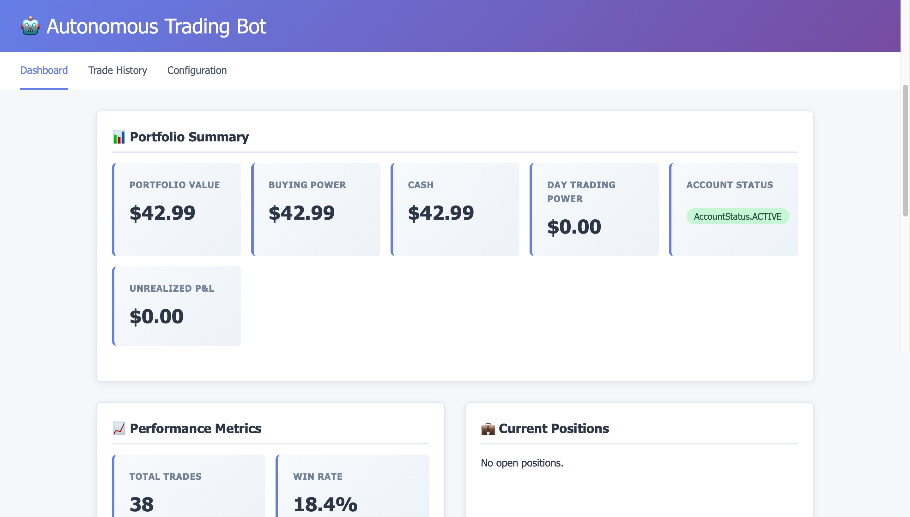
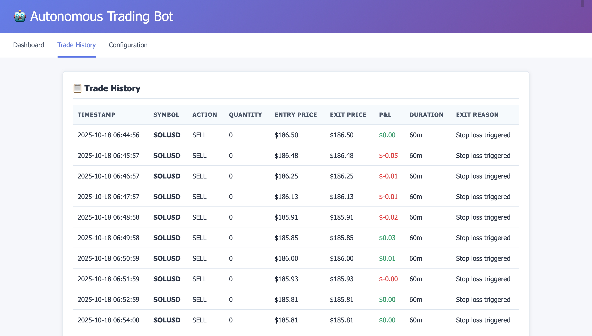
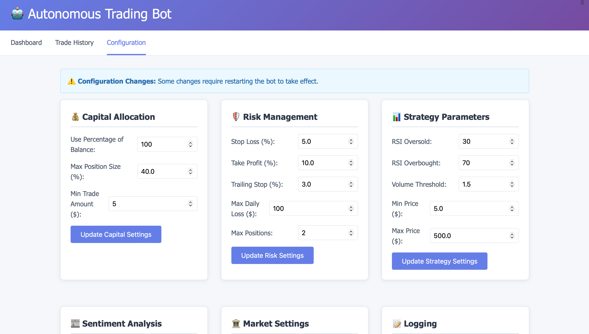

# 🤖 Autonomous Trading Bot  
A fully automated algorithmic trading system with a real-time dashboard, trade history, configurable strategy parameters, risk controls, and performance analytics.  
This bot uses RSI/MACD-driven logic, capital allocation rules, and risk management safeguards to execute trades automatically.

This project demonstrates real-world algorithmic trading system architecture, Python automation, Flask UI development, and AI-assisted engineering.

---

## 📸 Screenshots

### 📊 Dashboard  
Shows portfolio value, buying power, P&L, and performance metrics.  


### 📈 Trade History  
Full log of past trades with timestamps, P&L, and exit reasons.  


### ⚙️ Configuration Panel  
Adjust strategy parameters, risk limits, and capital allocation.  


---

## 🚀 Features

### 🧠 Algorithmic Strategy  
- RSI Oversold / Overbought detection  
- Volume confirmation  
- Optional MACD confirmation logic  
- Configurable parameters  
- Real-time execution  

### 📉 Risk Management  
- Stop loss  
- Take profit  
- Trailing stops  
- Max daily loss  
- Max open positions  
- Min/max trade size  

### 💰 Capital Allocation  
- Percentage-of-balance investing  
- Max position sizing rules  
- Minimum trade value  

### 📊 Performance Analytics  
- Win rate  
- Total trades  
- Total P&L  
- Current positions  
- Historical trade log  

### 🔧 Configurable Settings UI  
Modify strategy without editing code.

### 🖥 Web-Based Dashboard  
Built with Flask + modern UI to monitor everything live.

---

## 🛠 Tech Stack

**Backend & Trading Logic:**  
- Python  
- Pandas  
- NumPy  
- RSI / MACD indicators  
- Alpaca Trading API
- JSON state storage  

**Frontend / UI:**  
- Flask  
- Jinja2  
- HTML / CSS  
- Clean responsive layout  

**Deployment / Dev Tools:**  
- Git / GitHub  
- Render / Local Hosting  
- ChatGPT + Warp (AI-assisted development)

---

## 🧩 How the Bot Works

### 1️⃣ Market Data  
The bot fetches price data every cycle and processes:
- Close prices  
- Volume  
- Moving averages  

### 2️⃣ Indicator Engine  
Calculates:  
- RSI (14)  
- MACD line  
- Signal line  
- Volume threshold checks  

### 3️⃣ Trade Rules  
**BUY when:**  
- RSI < oversold threshold  
- Volume > threshold  
- Price within min/max range  
- Risk + capital rules allow  

**SELL when:**  
- Take profit hit  
- Stop loss hit  
- Trailing stop triggered  
- RSI crosses overbought threshold  

### 4️⃣ Portfolio Engine  
Tracks:  
- Balance  
- Positions  
- Unrealized P&L  
- Trade history  

### 5️⃣ UI + Monitoring  
All activity updates live on the dashboard.

---

## 📷 Quick Start Guide

### 1. **Installation**

```bash
# Clone the repository
git clone https://github.com/Elliott1985/rsi-trading-bot.git
cd rsi-trading-bot/production

# Install dependencies
pip3 install alpaca-trade-api pandas numpy textblob flask requests
```

### 2. **Configuration**

Create `api_keys.env` in the project root:

```env
ALPACA_API_KEY=your_alpaca_api_key
ALPACA_SECRET_KEY=your_alpaca_secret_key
ALPACA_BASE_URL=https://paper-api.alpaca.markets
```

Get your free Alpaca API keys at [alpaca.markets](https://alpaca.markets/)

### 3. **Run the Dashboard**

```bash
python3 run_bot.py --mode dashboard
# Open http://localhost:5000
```

### 4. **Run the Bot** (Live Trading)

```bash
python3 run_bot.py --mode bot
# Bot will automatically scan and execute trades
```

---

## 📂 Project Structure

```
production/
├── src/
│   ├── api/                    # Alpaca API client
│   ├── strategy/               # Technical & sentiment analysis
│   ├── utils/                  # Config, logging, risk management
│   ├── dashboard/              # Flask web interface
│   └── main_bot.py            # Main orchestrator
├── config/                     # Configuration files
│   └── trading_config.json    # Strategy parameters
├── logs/                       # Trade logs & performance data
├── templates/                  # HTML templates for dashboard
└── run_bot.py                 # Startup script
```

---

## ⚙️ Configuration

Edit `config/trading_config.json` to customize:

- **Capital Allocation**: What % of balance to use
- **Risk Limits**: Stop loss, take profit, max daily loss
- **Position Sizing**: Max positions, min/max trade size
- **Strategy Parameters**: RSI thresholds, volume filters, price ranges

All settings can also be modified through the web dashboard.

---

## 🚨 Disclaimers

**⚠️ Trading involves risk. This bot trades with REAL MONEY when connected to live Alpaca API.**

- Start with paper trading to test the system
- Past performance does not guarantee future results
- You can lose money trading
- Monitor the bot closely, especially initially
- Use at your own risk

---

## 🎓 Built With AI Assistance

This project was developed using:
- **ChatGPT** for code generation and problem-solving
- **Warp AI** for terminal commands and debugging
- **GitHub Copilot** for code completion

It demonstrates how AI tools can accelerate development of complex trading systems while maintaining production-quality code.

---

## 📞 Support

For questions or issues:
- Review logs in `production/logs/`
- Check configuration in `config/trading_config.json`
- Verify Alpaca API keys and account status
- Ensure market hours for live trading

---

## 📄 License

MIT License - feel free to use and modify for your own projects.

**Built by [@Elliott1985](https://github.com/Elliott1985) with AI assistance**
